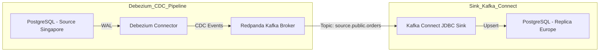

# 🌍 Replikasi PostgreSQL Lintas Wilayah dengan Debezium dan Redpanda

Bayangkan kamu punya database utama (PostgreSQL) yang sibuk melayani transaksi di Singapura. Di sisi lain, tim data di Eropa butuh akses *real-time* ke data untuk dashboard analytics tanpa membebani database utama. Solusinya? **Replikasi data secara real-time ke replica read-only di Eropa.**

Inilah saatnya kita bicara tentang **Change Data Capture (CDC)** dengan **Debezium**, **Redpanda**, dan **Kafka Connect**.

---

## 🧩 Use Case: Replikasi Real-Time untuk Analytics

💡 **Scenario:**
Sinkronisasi data dari PostgreSQL operasional di Singapura ke PostgreSQL replica di Eropa, dengan tujuan:

* 📦 **Backup Realtime**
* 📊 **Read Scaling untuk Dashboard Analytics**
* 🌐 **Cross-region Data Availability**

---

## 🛠️ Tech Stack

| Komponen               | Deskripsi                                                      |
| ---------------------- | -------------------------------------------------------------- |
| 🔗 **Source DB**       | PostgreSQL (menggunakan Write-Ahead Log / WAL)                 |
| 🧠 **CDC Engine**      | [Debezium](https://debezium.io/)                               |
| 🚇 **Transport Layer** | [Redpanda](https://redpanda.com/) / Kafka                      |
| 📥 **Sink**            | Kafka Connect dengan JDBC Sink Connector ke PostgreSQL replica |

---

## 🔍 Cara Kerja

Debezium memantau perubahan data (insert/update/delete) dari database PostgreSQL menggunakan WAL. Setiap perubahan dikemas menjadi event dan dikirim ke broker Redpanda.

Dari sana, Kafka Connect membaca topik-topik yang relevan, lalu menyimpannya ke replica PostgreSQL menggunakan JDBC Sink Connector.

---

## 🔄 Alur Visual

---

## 🚀 Kapan Ini Berguna?

* Kamu ingin **mengurangi beban baca** di database utama.
* Butuh data **fresh** di lokasi berbeda untuk analisis lokal.
* Perlu solusi **high availability** untuk disaster recovery.
* Atau, sedang membangun **data lake / lakehouse** modern berbasis event-driven.

---

## 📦 Contoh Project

Untuk implementasi real-world, kamu bisa mulai dengan proyek berikut:

👉 **[PostgreSQL Replication with Debezium](https://github.com/ciazhar/go-start-small/tree/v2/internal/cdc_postgres_debezium_redpanda_kafka_connect_postgres_data_replication)**
*(Link ke GitHub kamu atau dokumentasi project)*

---

## ✨ Penutup

CDC bukan sekadar buzzword — ini adalah fondasi utama dari arsitektur data modern. Dengan sedikit konfigurasi dan tool seperti Debezium & Redpanda, kamu bisa membangun sistem replikasi yang tangguh, real-time, dan scalable.

Punya pertanyaan? Atau mau aku bantu setup-nya? Drop komentar, yuk! 💬